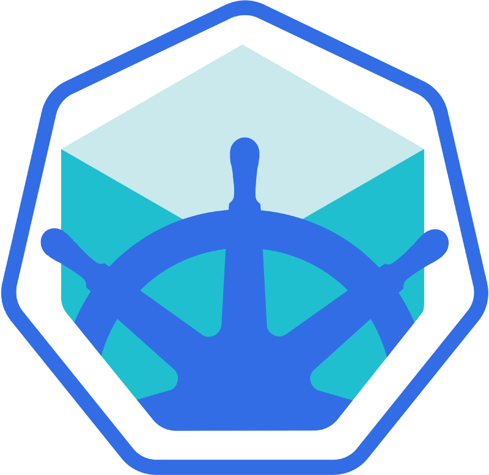

<p align="center">
	
</p>

Nếu như bạn đang học Kubernetes và cố gắng chạy Minikube trên EC2 Instance, bạn chắc chắn giống mình. Mình không thực sự thích việc cài mọi thứ trên máy tính cá nhân và dùng nó chỉ để cho học tập hay trong 1 thời gian ngắn. EC2 là 1 lựa chọn hợp lý. Nhưng mình đã rất khó khăn để chạy được Minikube trên AWS EC2 cho lần đầu tiền. Dưới đây là tổng hợp ngắn của mình về cách chạy Minikube trên AWS EC2.

### 1. Thiết lập 1 public EC2 Server với cấu hình sau:

|  Tag   |  Mô tả                                                           |
| :---                   |                                                                             :--- |
| **AMI**                | Ubuntu Server 18.04 LTS (HVM), SSD Volume Type - ami-0ac019f4fcb7cb7e6           |
| **Instance Type**	     | t2.medium                                                                        |
| **Storage**     	     | 22 GB (gp2)                                                                      |
| **Security Group**     | Vì để phục vụ cho việc học tập, bạn có thể mở quyền truy cập cho tất cả các cổng |
| **Key Pair**	  	     | Bạn sẽ cần key này để truy cập vào EC2 Instance                                  |

Bạn phải sử dụng `t2.medium` Type bởi vì Minikube hiện tại yêu cầu ít nhất 2 vCPUs.

### 2. Truy cập vào EC2 Instance bằng cách sử dụng keypair

```sh
ssh ubuntu@<ipv4_public_ip> -i <keypair>.pem
```

### 3. Cài đặt kubectl

```sh
curl -LO https://storage.googleapis.com/kubernetes-release/release/$(curl -s https://storage.googleapis.com/kubernetes-release/release/stable.txt)/bin/linux/amd64/kubectl
chmod +x ./kubectl
sudo mv ./kubectl /usr/local/bin/kubectl
```

### 4. Cài đặt Docker

```sh
sudo apt-get -y update
sudo apt-get install -y apt-transport-https ca-certificates curl software-properties-common

# Installing Docker
curl -fsSL https://download.docker.com/linux/ubuntu/gpg | sudo apt-key add -
sudo add-apt-repository "deb [arch=amd64] https://download.docker.com/linux/ubuntu $(lsb_release -cs) stable"
sudo apt-cache policy docker-ce
sudo apt-get install -y docker-ce
sudo usermod -aG docker ubuntu
# Setup daemon.
sudo bash -c 'cat > /etc/docker/daemon.json <<EOF
{
"exec-opts": ["native.cgroupdriver=systemd"],
"log-driver": "json-file",
"log-opts": {
  "max-size": "100m"
},
"storage-driver": "overlay2"
}
EOF'
sudo mkdir -p /etc/systemd/system/docker.service.d

# Restart docker.
sudo systemctl daemon-reload
sudo systemctl restart docker
```

### 5. Cài đặt kubectl

```sh
curl -LO https://storage.googleapis.com/kubernetes-release/release/$(curl -s https://storage.googleapis.com/kubernetes-release/release/stable.txt)/bin/linux/amd64/kubectl
chmod +x ./kubectl
sudo mv ./kubectl /usr/local/bin/kubectl
```

### 6. Cài đặt Minikube

```sh
curl -Lo minikube https://storage.googleapis.com/minikube/releases/v${MINIKUBE}/minikube-linux-amd64 && chmod +x minikube && sudo cp minikube /usr/local/bin/ && rm minikube
```

### 7. Kiểm tra Minikube Version

```sh
$ sudo minikube version
minikube version: v1.0.1
```

Chúng ta đã cài đặt thành công Minikube.

Hãy chạy thử Minikube!

### 8. Khởi chạy Minikube

```sh
sudo minikube start --vm-driver=none --extra-config=kubelet.cgroup-driver=systemd
```

Note: Mặc định, Minikube cần truy cập bào BIOS của máy tính. Nhưng chúng ta không thể truy cập vì EC2 Instance là 1 Virtual Machine. Vì vậy chúng ta cần thêm flag: --vm-driver=none

### 9. Hãy kiểm thử trạng thái của Minikube

```sh
$ sudo minikube status
host: Running
kubelet: Running
apiserver: Running
kubectl: Correctly Configured: pointing to minikube-vm at 10.4.0.72
```

### 10. Hãy chạy thử container đầu tiên

```sh
$ sudo kubectl run hello-minikube --image=gcr.io/google_containers/echoserver:1.4 --port=8080
kubectl run --generator=deployment/apps.v1 is DEPRECATED and will be removed in a future version. Use kubectl run --generator=run-pod/v1 or kubectl create instead.
deployment.apps/hello-minikube created
```

### 11. Hãy cung cấp cổng cho container để chúng ta có thể truy cập đươc vào nó

```sh
$ sudo kubectl expose deployment hello-minikube --type=NodePort
service/hello-minikube exposed
```

### 12. Hiển thị port để truy cập vào container

```sh
$ sudo kubectl get services
NAME             TYPE        CLUSTER-IP      EXTERNAL-IP   PORT(S)          AGE
hello-minikube   NodePort    10.105.67.232   <none>        8080:32656/TCP   75s
kubernetes       ClusterIP   10.96.0.1       <none>        443/TCP          16m
```

Chúng ta có thể thấy cổng `32656` được public ra để ta có thể truy cập vào container.

Note: Chú ý khi setup EC2 Instance, chúng ta đã mở quyền truy cập vào tất cả các cổng, nên mình nghĩ bạn sẽ không gặp bất cứ lỗi truy cập nào khi truy cập cổng 32656 của EC2.

Đây là ví dụ mẫu của kết quả truy cập:

```sh
http://<ipv4_public_ip>:32656

CLIENT VALUES:
client_address=172.17.0.1
command=GET
real path=/
query=nil
request_version=1.1
request_uri=http://<ipv4_public_ip>:8080/

SERVER VALUES:
server_version=nginx: 1.10.0 - lua: 10001

HEADERS RECEIVED:
accept=text/html,application/xhtml+xml,application/xml;q=0.9,image/webp,image/apng,*/*;q=0.8,application/signed-exchange;v=b3
accept-encoding=gzip, deflate
accept-language=en-US,en;q=0.9,vi-VN;q=0.8,vi;q=0.7
connection=keep-alive
host=<ipv4_public_ip>:32656
upgrade-insecure-requests=1
user-agent=Mozilla/5.0 (Macintosh; Intel Mac OS X 10_14_4) AppleWebKit/537.36 (KHTML, like Gecko) Chrome/74.0.3729.131 Safari/537.36
BODY:
-no body in request-
```
### 13. Xóa service và dừng Minikube

```sh
# Delete the exposed service (port)
$ sudo kubectl delete services hello-minikube

# Delete the deployed container (hello-minikube)
$ sudo kubectl delete deployment hello-minikube

# Stopping Minikube/Shutting Down the Cluster
$ minikube stop
```
### Kết luận

Trên đây là bài tổng hợp của mình về việc chạy Minikube trên EC2 Instance. Rất hi vọng sẽ giúp và tiết kiệm được thời gian của nhiều bạn.

Hãy theo dõi blog của mình và để lại comment để giúp mình có thêm động lực chia sẻ nhiều hơn :)

### Link tham khảo

- [kubelet-failed-with-kubelet-cgroup-driver-cgroupfs-is-different-from-docker-c](https://stackoverflow.com/questions/45708175/kubelet-failed-with-kubelet-cgroup-driver-cgroupfs-is-different-from-docker-c)

